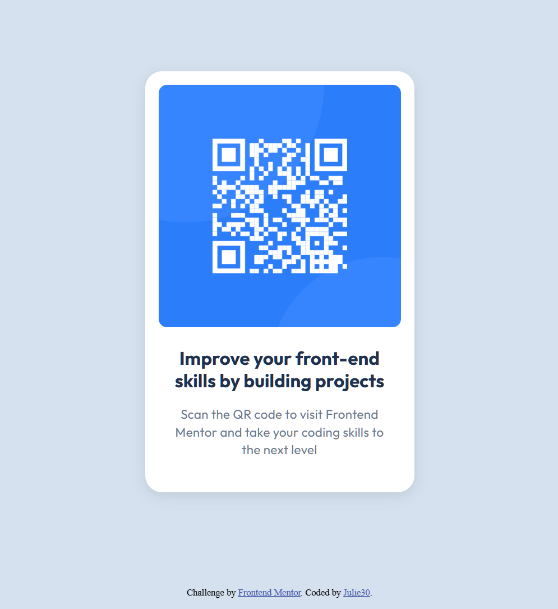

# Frontend Mentor - QR code component solution

This is my solution to the QR code component challenge on Frontend Mentor. The project helped me practice semantic HTML, CSS layout, spacing, and responsive design principles.

## Overview

### Screenshot

### Links

- Solution URL: https://github.com/julie30/qr-card-design
- Live Site URL: https://julie30.github.io/qr-card-design/

## My process

### Built with

- Semantic HTML5
- CSS custom properties
- Flexbox
- Mobile-first workflow

### What I learned

During this project I improved my understanding of:

- semantic HTML structure
- box-sizing and spacing
- centering elements with Flexbox
- working with CSS variables
- border-radius and overflow behavior
- responsive layouts

Example:
* {
  box-sizing: border-box;
}

Continued development

In future projects I want to continue improving:

responsive design skills
accessibility
CSS layout techniques
cleaner component structure
Useful resources
https://developer.mozilla.org/
https://frontendmentor.io/
https://css-tricks.com/
AI Collaboration

I used Google (searched for how to...), ChatGPT as a learning assistant during this project. It helped me:

understand CSS layout issues
debug spacing and sizing problems
improve semantic HTML structure
better understand Flexbox and box-sizing

The project code and final implementation were written and adjusted by me as part of the learning process.

Author
Frontend Mentor - https://www.frontendmentor.io/profile/Julie30
